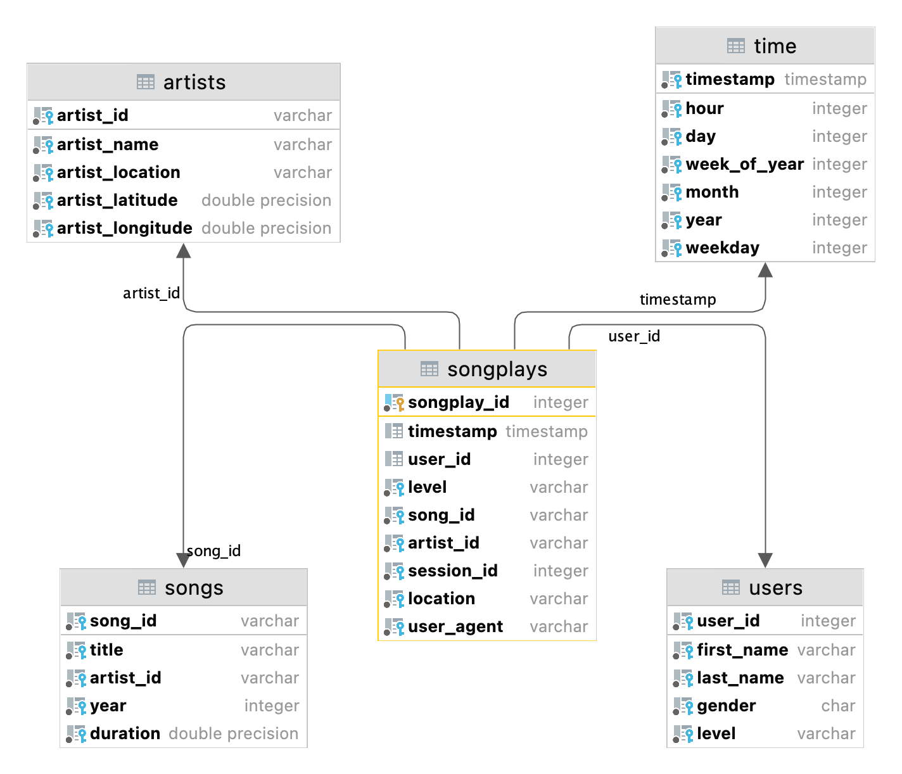

# Project: Data Modeling with Postgres

## Overview
The goal of the project is to create a database for song play analysis. 
The database consists of the following tables.

* fact table
  * songplays
* dimension tables
  * songs
  * artists
  * time
  * users



## How to run the scripts

```bash
# 1. create tables (exisiting tables will be dropped at fisrt)
python create_tables.py

# 2. insert data to tables
python etl.py
```

## list of files
* 


